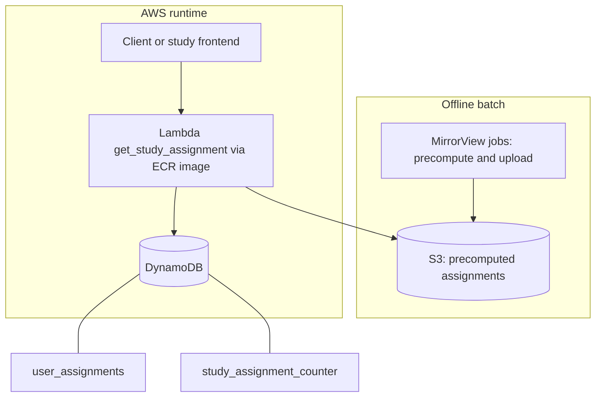
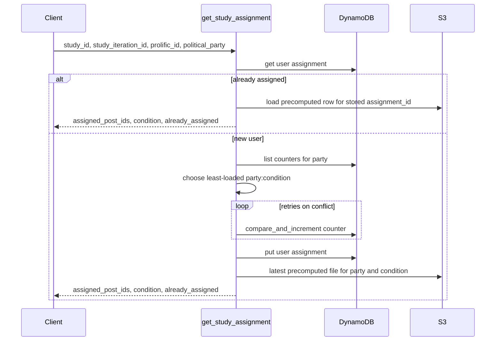

# Study Participant Assignment Interface

Backend service and batch tooling for **consistent, race-safe assignment** of participants in custom web experiments—without tying studies to survey platforms like Qualtrics.

## Purpose and motivation

Online experiments often need each participant to receive a **predefined bundle** of stimuli (for example, which posts they see). Teams have repeatedly reimplemented the same ideas with fragile patterns (shared JSON files, ad hoc Lambdas), which creates **time-of-check/time-of-use (TOCTOU) races**: two participants can read the same state and both claim the same slot.

This repository implements a single pattern:

1. **Precompute** assignment bundles offline, inspect balance and quality before going live.
2. **Assign atomically** using DynamoDB so concurrent sign-ups cannot take the same precomputed row.
3. **Reuse** the same flow across studies instead of one-off scripts per experiment.

For full problem framing and evolution of the design, see [`strategy_planning/2026-04-03_v1_system_design.md`](strategy_planning/2026-04-03_v1_system_design.md).

**Pilot use case:** [MirrorView](https://github.com/METResearchGroup/mirrorView-task). Study-specific batch jobs for that project live under [`jobs/mirrorview/`](jobs/mirrorview/).

## What this repository contains

| Area | Description |
|------|-------------|
| **Runtime** | AWS Lambda **`get_study_assignment`** (container image): looks up or creates a per-user assignment, balances across conditions using counters, loads the matching precomputed row from S3, returns `assigned_post_ids`, `condition`, and `already_assigned`. Implementation: [`lambdas/get_study_assignment/handler.py`](lambdas/get_study_assignment/handler.py). |
| **Data** | **S3** stores precomputed assignment artifacts (CSV consumed by the handler). **DynamoDB** stores per-user assignment records and per-cell counters. Bucket and tables are provisioned/configured in Terraform. |
| **Libraries** | [`lib/dynamodb.py`](lib/dynamodb.py) — user assignments, counters, compare-and-increment with conflict handling. [`lib/s3.py`](lib/s3.py) — ordered key listing and loading objects into pandas. |
| **Batch jobs** | [`jobs/mirrorview/`](jobs/mirrorview/) — deterministic assignment IDs, precomputation, upload to S3. |
| **Infrastructure** | [`infra/`](infra/) — DynamoDB tables, ECR repository, IAM role, image-based Lambda. Variables such as S3 bucket and image URI: [`infra/variables_get_study_assignment.tf`](infra/variables_get_study_assignment.tf). |
| **Operations** | [`docs/runbook/DEPLOY_INFRA.md`](docs/runbook/DEPLOY_INFRA.md) — AWS CLI, Terraform, Docker build, ECR push via [`scripts/build_and_push_lambda_image_to_ecr.sh`](scripts/build_and_push_lambda_image_to_ecr.sh). |

The Lambda is intended to be invoked with the AWS SDK, CLI, or a future API layer (for example API Gateway); this repo does not assume a specific HTTP front door.

## Architecture

### Components

### Request flow

### DynamoDB key model

In AWS, tables use **composite sort keys** built in [`lib/dynamodb.py`](lib/dynamodb.py):

- **`user_assignments`:** partition `study_id`, sort key **`iteration_user_key`** = `{study_iteration_id}#{user_id}` (components must not contain `#`).
- **`study_assignment_counter`:** partition `study_id`, sort key **`iteration_assignment_key`** = `{study_iteration_id}#{study_unique_assignment_key}` (for example `democrat:control`).

## Setup and deployment

1. **Prerequisites:** Terraform, AWS CLI v2, Docker with **buildx**, Python 3.12 and [`uv`](https://github.com/astral-sh/uv). See the runbook for credential and region expectations (default region in docs is `us-east-2`).
2. **Python environment:** from the repository root, run `uv sync --all-groups`.
3. **Infrastructure and container image:** follow [`docs/runbook/DEPLOY_INFRA.md`](docs/runbook/DEPLOY_INFRA.md) for `terraform init` / `plan` / `apply`, building with **`linux/amd64`** (Lambda `x86_64`), pushing to ECR, and rolling out function code (including digest pinning when reusing the `:latest` tag).

## Verification

| Check | Command / location |
|-------|-------------------|
| DynamoDB smoke tests | `PYTHONPATH=. uv run python infra/tests/dynamodb_e2e_tests.py` (set `AWS_REGION`, `USER_ASSIGNMENTS_TABLE_NAME`, `STUDY_ASSIGNMENT_COUNTER_TABLE_NAME` as in the runbook) |
| Handler unit tests | `PYTHONPATH=. uv run pytest lambdas/get_study_assignment/tests/test_handler.py` |
| Handler smoke tests | `PYTHONPATH=. uv run python lambdas/get_study_assignment/smoke_tests/run_handler_smoke_tests.py --backend local` (also supports `docker` and `prod`; production requires explicit opt-in env vars—see [`lambdas/get_study_assignment/smoke_tests/README.md`](lambdas/get_study_assignment/smoke_tests/README.md)) |
## Infra deployment (detail)

Step-by-step AWS and Terraform procedures live in [`docs/runbook/DEPLOY_INFRA.md`](docs/runbook/DEPLOY_INFRA.md).
