# Enable Prod Smoke Backend Plan

## Scope

Implement production smoke execution for `get_study_assignment` using existing Lambda Invoke backend, while keeping handler env-var refactors out of scope.

## Current Gap

- The prod backend implementation exists in `[lambdas/get_study_assignment/smoke_tests/handler_invokers.py](/Users/mark/Documents/work/worktree_study_participant_assignment_interface/lambdas/get_study_assignment/smoke_tests/handler_invokers.py)`, but runner logic still stubs prod and exits 0 unless `SMOKE_PROD_ENABLED=true` in `[lambdas/get_study_assignment/smoke_tests/run_handler_smoke_tests.py](/Users/mark/Documents/work/worktree_study_participant_assignment_interface/lambdas/get_study_assignment/smoke_tests/run_handler_smoke_tests.py)`.
- Documentation still presents prod as default stub in `[lambdas/get_study_assignment/smoke_tests/README.md](/Users/mark/Documents/work/worktree_study_participant_assignment_interface/lambdas/get_study_assignment/smoke_tests/README.md)`.

## Implementation

- Update runner behavior in `[lambdas/get_study_assignment/smoke_tests/run_handler_smoke_tests.py](/Users/mark/Documents/work/worktree_study_participant_assignment_interface/lambdas/get_study_assignment/smoke_tests/run_handler_smoke_tests.py)`:
  - Remove the `SMOKE_PROD_ENABLED` no-op stub path.
  - Keep `SMOKE_ALLOW_PROD=true` as the explicit safety gate.
  - Improve prod error message text so missing vars clearly list `AWS_REGION`, `SMOKE_PROD_LAMBDA_NAME`, and table env vars required by the suite.
- Preserve and lightly harden prod invoker in `[lambdas/get_study_assignment/smoke_tests/handler_invokers.py](/Users/mark/Documents/work/worktree_study_participant_assignment_interface/lambdas/get_study_assignment/smoke_tests/handler_invokers.py)`:
  - Keep `FunctionError`/status handling.
  - Ensure raised errors are explicit enough for IAM (`AccessDeniedException`) and missing function (`ResourceNotFoundException`) troubleshooting.
- Update smoke docs in `[lambdas/get_study_assignment/smoke_tests/README.md](/Users/mark/Documents/work/worktree_study_participant_assignment_interface/lambdas/get_study_assignment/smoke_tests/README.md)`:
  - Reframe prod as active path (not stub).
  - Provide one canonical prod command for your deployed function from PR #9 (`SMOKE_PROD_LAMBDA_NAME=get_study_assignment`, `AWS_REGION=us-east-2`).
  - Add a short “required IAM for smoke caller” note (`lambda:InvokeFunction` on target function).
  - Keep optional qualifier flow documented.
- Optional follow-up doc touch (if desired for discoverability):
  - Add one-line pointer in `[lambdas/README.md](/Users/mark/Documents/work/worktree_study_participant_assignment_interface/lambdas/README.md)` to the unified smoke README.

## Expected Runtime/Data Behavior

- Smoke suite continues to seed/query/teardown DynamoDB and S3 via existing fixture flow in `[lambdas/get_study_assignment/smoke_tests/handler_smoke_suite.py](/Users/mark/Documents/work/worktree_study_participant_assignment_interface/lambdas/get_study_assignment/smoke_tests/handler_smoke_suite.py)`.
- Prod backend now executes real assertions against deployed Lambda response contract rather than exiting early.

```mermaid
flowchart LR
  runner[runHandlerSmokeTests] --> backendSelect[backend=prod]
  backendSelect --> safetyGate[SMOKE_ALLOW_PROD check]
  safetyGate --> prodInvoker[ProdLambdaHandlerInvoker]
  prodInvoker --> lambdaInvoke[boto3 lambda.invoke]
  lambdaInvoke --> payloadParse[status and FunctionError checks]
  payloadParse --> sharedSuite[sharedSmokeAssertions]
  sharedSuite --> awsFixtures[dynamoAndS3 setup/teardown]
```

## Manual Verification

- Local sanity (no behavior regression):
  - Run `--backend local` and confirm suite still passes.
- Prod happy path:
  - Run prod command with:
    - `SMOKE_BACKEND=prod`
    - `SMOKE_ALLOW_PROD=true`
    - `AWS_REGION=us-east-2`
    - `SMOKE_PROD_LAMBDA_NAME=get_study_assignment`
    - `USER_ASSIGNMENTS_TABLE_NAME=user_assignments`
    - `STUDY_ASSIGNMENT_COUNTER_TABLE_NAME=study_assignment_counter`
  - Expect real test execution (not stub), normal pass/fail output, non-zero exit on failures.
- Guardrail checks:
  - Omit `SMOKE_ALLOW_PROD` and confirm fast, explicit refusal.
  - Use invalid Lambda name and confirm clear invocation failure message.

## Risks and Mitigations

- Risk: accidental prod invocation.
  - Mitigation: retain strict `SMOKE_ALLOW_PROD=true` gate.
- Risk: IAM confusion for callers.
  - Mitigation: document required `lambda:InvokeFunction` permission and error signatures.
- Risk: flaky prod timing due to function timeout/cold start.
  - Mitigation: capture failures with explicit backend-tagged errors; evaluate timeout tuning separately if flakes appear.

