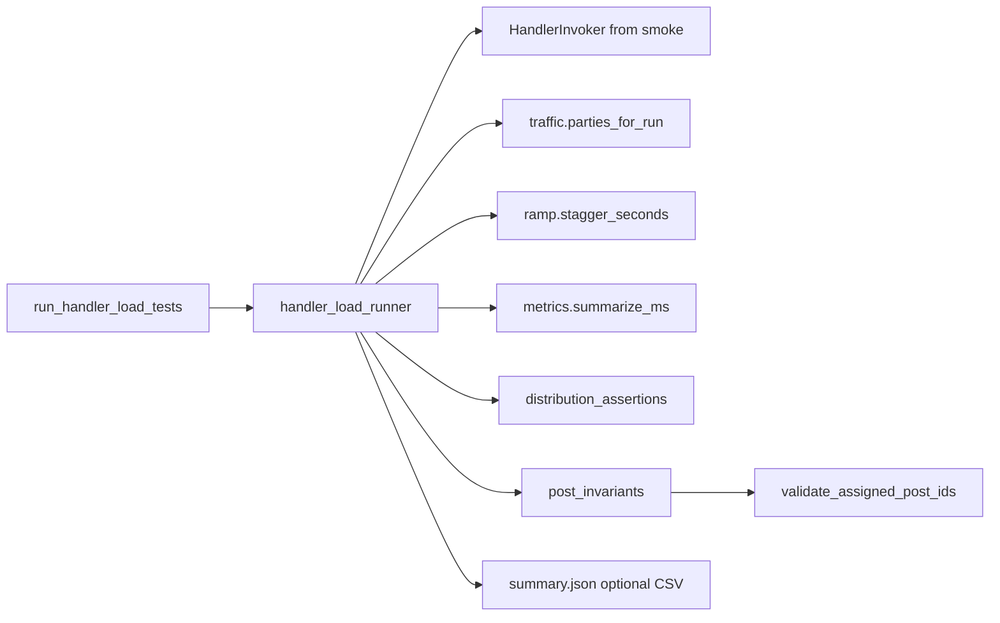

# Iterative implementation plan: `get_study_assignment` load testing

## Remember

- Exact file paths always
- Exact commands with expected output
- DRY, YAGNI, TDD, frequent commits
- Maximum safely delegable parallelism
- Delegated tasks must be impossible to misread
- No UI in scope: no `ui/` screenshots

After approval, store plan-related artifacts under `docs/plans/2026-04-05_load_testing_get_study_assignment_<hash>/` (per [PLANNING_RULES.md](file:///Users/mark/Documents/projects/ai_tools/agents/task_instructions/rules/PLANNING_RULES.md)); this session only produces the plan text.

---

## Happy Flow

1. Operator runs `[lambdas/get_study_assignment/load_tests/run_handler_load_tests.py](lambdas/get_study_assignment/load_tests/run_handler_load_tests.py)` (or `uv run python -m lambdas.get_study_assignment.load_tests.run_handler_load_tests`) with `--backend`, **--users** (optional, **default 2000**), `--ramp-seconds`, `--scenario`, optional `--report-dir`, optional `**--no-cleanup`** (see step 12).
2. **While building and testing this feature:** use **--users 5** for every manual verification command, integration test that invokes the real handler, and every example in this plan except the final stress run (I10). **Exception:** [PLAN_LOAD_TESTING.md](PLAN_LOAD_TESTING.md) **alternate** scenario exact counts (R14) require **N % 4 == 0**; **N=5 cannot satisfy R14**. Cover **alternate** distribution in **unit tests** at N=4 / N=8; manual runs at N=5 use **--scenario random** (or checks that skip R14).
3. CLI resolves backend like smoke: default `LOAD_BACKEND` / `--backend`; prod requires `LOAD_ALLOW_PROD=true` and the same table/region/Lambda env vars as `[smoke_tests/run_handler_smoke_tests.py](lambdas/get_study_assignment/smoke_tests/run_handler_smoke_tests.py)` (see **Contract freeze** for the chosen Lambda env var name).
4. `[handler_load_runner.py](lambdas/get_study_assignment/load_tests/handler_load_runner.py)` builds invoker via **imported** `build_invoker` from smoke (avoid duplicating factory in v1 unless you later extract `[invoker_factory.py](lambdas/get_study_assignment/invoker_factory.py)` in a dedicated refactor).
5. Runner sets `study_id` (default `dev_jspsych-pilot-3`) and fresh `study_iteration_id` from `[study_ids.py](lambdas/get_study_assignment/load_tests/study_ids.py)` using `[lib/timestamp_utils.py](lib/timestamp_utils.py)` `get_current_timestamp()`.
6. For each `i in 0..N-1`: deterministic `prolific_id` (e.g. `load-{iteration_slug}-{i:05d}`), `political_party` from `[traffic.py](lambdas/get_study_assignment/load_tests/traffic.py)` (`alternate` or `random` with `seed=42`).
7. `[ramp.py](lambdas/get_study_assignment/load_tests/ramp.py)` staggers each task: `sleep((i/N)*T)` then `invoker.invoke(event)` inside `ThreadPoolExecutor(max_workers=min(32, configured))`.
8. Each outcome is classified: **hard failure** (transport, non-dict, missing/malformed `assigned_post_ids`) vs success. On first hard failure, **stop scheduling new work** (cancel remaining futures or use a shutdown flag) per [PLAN_LOAD_TESTING.md §3](PLAN_LOAD_TESTING.md); still record what completed for the report.
9. `[metrics.py](lambdas/get_study_assignment/load_tests/metrics.py)` aggregates latency (ms) for **successful** invokes only; stdout + optional `summary.json` contain **aggregate** percentiles only (R15).
10. Build `Counter` of `(request_party, response_condition)`; run `[distribution_assertions.py](lambdas/get_study_assignment/load_tests/distribution_assertions.py)` for the scenario (alternate: exact; random: 95% binomial interval **and** ±100 slack).
11. For each successful bundle, `[post_invariants.py](lambdas/get_study_assignment/load_tests/post_invariants.py)` calls shared `validate_assigned_post_ids` (ground truth from the same CSV path as precompute/MirrorView); collect up to **10** detailed violations, continue through all N for latency completeness.
12. Exit **0** iff hard failures == 0 and invariant violations ≤ 10; else non-zero. If `--cleanup-after`, tear down Dynamo/S3 for that iteration analogously to `[handler_smoke_suite.py](lambdas/get_study_assignment/smoke_tests/handler_smoke_suite.py)` teardown scope.

---

## Serial coordination spine (order of work)

1. **Scaffold** package `[lambdas/get_study_assignment/load_tests/](lambdas/get_study_assignment/load_tests/)` + test directory layout (see pytest note below).
2. **Pure modules** with unit tests: `study_ids`, `traffic`, `ramp`, `metrics`, `distribution_assertions` (these define the numerical/statistical behavior independent of AWS).
3. **Shared validation extraction**: public `validate_assigned_post_ids(post_ids, ground_truth_df)` in a small shared module (e.g. `[lib/mirrorview_assignment_validate.py](lib/mirrorview_assignment_validate.py)` or under `jobs/mirrorview/`) — refactor `[validate_precomputed_assignments.py](jobs/mirrorview/validate_precomputed_assignments.py)` to call it so offline validation and load tests stay DRY.
4. `**post_invariants.py`**: load ground-truth DataFrame indexed by `post_primary_key`, delegate to shared validator.
5. `**handler_load_runner.py`**: orchestration + fake invoker tests (no AWS).
6. `**run_handler_load_tests.py`**: argparse, prod guard, env defaults, call runner.
7. **Reporting + cleanup**: JSON aggregates, optional CSV; `--cleanup-after` wired to reuse smoke cleanup patterns or shared helpers.
8. **Short `[load_tests/README.md](lambdas/get_study_assignment/load_tests/README.md)`** (runbook, env vars, prod warning) — only after behavior is stable.

**Pytest note:** `[pyproject.toml](pyproject.toml)` currently sets `testpaths = ["jobs/mirrorview/tests"]`. Either add `lambdas/get_study_assignment/load_tests/tests` (and optionally existing lambda tests) to `testpaths`, or document running load tests explicitly:  
`uv run pytest lambdas/get_study_assignment/load_tests/tests -q`  
Pick one approach in the chunk that introduces the first tests and keep it consistent.

**Binomial interval (R12):** Project has `numpy`/`pandas` but not `scipy`. Implement **Clopper-Pearson** (exact) with a small dependency-free helper, or add `scipy` to `[dependency-groups] dev` only if you prefer `scipy.stats.binomtest`. Record `interval_method` in `summary.json`.

---

## Interface or contract freeze

| Contract            | Definition                                                                                                                                                                                                                                                                                                |
| ------------------- | --------------------------------------------------------------------------------------------------------------------------------------------------------------------------------------------------------------------------------------------------------------------------------------------------------- |
| `HandlerInvoker`    | `[handler_invokers.HandlerInvoker](lambdas/get_study_assignment/smoke_tests/handler_invokers.py)` — `invoke(event: Mapping) -> dict[str, Any]`                                                                                                                                                            |
| Event shape         | `study_id`, `study_iteration_id`, `prolific_id`, `political_party` (same as smoke `_make_event`)                                                                                                                                                                                                          |
| Success for latency | Response dict with usable `assigned_post_ids` (list of strings after JSON parse if string) — mirror R4                                                                                                                                                                                                    |
| Hard failure        | Transport/invoker error, wrong type, missing IDs — non-zero exit; stop new submissions                                                                                                                                                                                                                    |
| Invariant cap       | ≤10 violations pass; store detailed records for first 10 (document ordering: e.g. first-seen)                                                                                                                                                                                                             |
| Prod guard          | `LOAD_ALLOW_PROD=true`; reuse `SMOKE_PROD_LAMBDA_NAME` + same table env vars as smoke for v1 (document in README; avoids new `LOAD_PROD_LAMBDA_NAME` unless you prefer explicit separation later)                                                                                                         |
| Docker/local env    | Reuse `SMOKE_DOCKER_INVOKE_URL`, `SMOKE_DOCKER_TIMEOUT_SECONDS` (document as “same as smoke”)                                                                                                                                                                                                             |
| `--users`           | **Default 2000**. **While developing this feature:** use **5** for all manual verification and integration tests that hit real backends; **I10** is the only planned step that omits `--users` and relies on the default. Alternate (R14) manual checks are invalid at N=5—use **unit tests** at N=4/N=8. |

---

## Parallel task packets (after contract freeze)

These can run in parallel **once** the shared module path for `validate_assigned_post_ids` is **named** (file + function signature) even if the body is stubbed briefly—**do not** merge parallel PRs that both edit the same file.

### Packet A — `traffic.py`

- **Objective:** Deterministic `parties_for_run` for `alternate` and `random` (seed 42).
- **Parallelizable:** No imports from runner or AWS.
- **Inspect:** [PLAN_LOAD_TESTING.md §7.1](PLAN_LOAD_TESTING.md), `[handler_smoke_suite.py](lambdas/get_study_assignment/smoke_tests/handler_smoke_suite.py)` party strings.
- **Change:** `[lambdas/get_study_assignment/load_tests/traffic.py](lambdas/get_study_assignment/load_tests/traffic.py)`, `[lambdas/get_study_assignment/load_tests/tests/test_traffic.py](lambdas/get_study_assignment/load_tests/tests/test_traffic.py)`.
- **Forbidden:** `handler_load_runner.py`, `validate_precomputed_assignments.py`.
- **Preconditions:** Package `load_tests/` exists with `__init__.py`.
- **Dependencies:** None.
- **Invariants:** `len(parties) == n`; alternate even indices identical party choice (document democrat/republican mapping); random reproducible with seed.
- **Verify:** `uv run pytest lambdas/get_study_assignment/load_tests/tests/test_traffic.py -q` — all pass.
- **Done when:** Tests cover edge `n=1`, `n=4`, large `n` spot-check vs reference vector.

### Packet B — `ramp.py`

- **Objective:** `stagger_seconds(index, n, T)` linear ramp; boundaries ~0 and ~T for first/last.
- **Parallelizable:** Pure math.
- **Change:** `[ramp.py](lambdas/get_study_assignment/load_tests/ramp.py)`, `[tests/test_ramp.py](lambdas/get_study_assignment/load_tests/tests/test_ramp.py)`.
- **Forbidden:** Invoker imports.
- **Verify:** `uv run pytest .../test_ramp.py -q`.
- **Done when:** `n<=0` safe; last index `(n-1)/n*T` asserted.

### Packet C — `metrics.py`

- **Objective:** `summarize_ms` with min/mean/p50/p90/p95/p99/max; empty input behavior documented.
- **Change:** `[metrics.py](lambdas/get_study_assignment/load_tests/metrics.py)`, `[tests/test_metrics.py](lambdas/get_study_assignment/load_tests/tests/test_metrics.py)`.
- **Forbidden:** AWS.
- **Verify:** `uv run pytest .../test_metrics.py -q` with known quantiles on fixed samples.

### Packet D — `distribution_assertions.py`

- **Objective:** Alternate exact counts (require `N % 4 == 0`); random party split R12+R13.
- **Change:** `[distribution_assertions.py](lambdas/get_study_assignment/load_tests/distribution_assertions.py)`, `[tests/test_distribution_assertions.py](lambdas/get_study_assignment/load_tests/tests/test_distribution_assertions.py)`.
- **Forbidden:** Handler code.
- **Verify:** Property tests or table-driven cases for alternate; random assertions on synthetic counts near boundary.

**Not parallel with D until shared validator lands:** `post_invariants.py` (depends on extraction).

---

## Integration order (bite-sized merges)

| Chunk | Deliverable                                                         | Test / verify                                                                                                        |
| ----- | ------------------------------------------------------------------- | -------------------------------------------------------------------------------------------------------------------- |
| I1    | `load_tests/__init__.py`, `study_ids.py`, `test_study_ids.py`       | Prefix `dev`_, uses `get_current_timestamp`                                                                          |
| I2    | Packets A–D (can split into 4 commits)                              | Each `pytest` file green                                                                                             |
| I3    | Extract `validate_assigned_post_ids` + thin wrapper in validate job | `uv run pytest jobs/mirrorview/tests -q` + any existing validate tests                                               |
| I4    | `post_invariants.py` + tests (mock small DataFrame)                 | Unit tests only                                                                                                      |
| I5    | `handler_load_runner.py` + `FakeInvoker` recording latencies/errors | Integration test: **N=5**, T=0.1, max_workers=4, no AWS                                                              |
| I6    | Wire real `LocalHandlerInvoker`, **small** local run                | With real env: `**--users 5 --ramp-seconds 2 --scenario random`** (and `--seed 42`) exits 0 when fixtures sufficient |
| I7    | CLI `run_handler_load_tests.py` + prod/docker guards                | Same as I6 via module entrypoint; docker if RIE up: `**--users 5`**                                                  |
| I8    | `summary.json` (+ optional CSV), stdout summary fields from §9      | Inspect file contents; assert no per-request latency arrays                                                          |
| I9    | `--cleanup-after` + document default no-cleanup                     | Compare Dynamo/S3 before/after with `**--users 5`**                                                                  |
| I10   | Default `**--users 2000`** (omit flag), `T` default documented      | **Only here:** full acceptance from PLAN §8–10 (operator-led stress run); all prior steps used N=5                   |

---

## Manual verification checklist

**Convention:** every CLI example below uses `**--users 5`** unless noted. Omit `--users` only for the **I10** stress acceptance run (default **2000**).

- **Unit tests (load):** `uv run pytest lambdas/get_study_assignment/load_tests/tests -q` — exit 0, no failures (includes **alternate** at N=4/N=8 where R14 applies).
- **Regression (mirrorview):** `uv run pytest jobs/mirrorview/tests -q` — exit 0 after validator extraction.
- **Handler unit tests (if touched):** `uv run pytest lambdas/get_study_assignment/tests/test_handler.py -q` — exit 0.
- **Small local load:** AWS env per smoke README; run `--backend local --users 5 --ramp-seconds 2 --scenario random --seed 42 --report-dir /tmp/load-report`; exit 0; open `summary.json` and confirm aggregate latency keys only and distribution counts.
- **Random scenario checks:** Confirm stdout shows binomial interval and party counts within CI and ±100 for N=5.
- **Prod (optional):** Only with explicit intent: `LOAD_ALLOW_PROD=true`, same tables as smoke, `**--users 5`** first; confirm safety message matches smoke style.
- **Ramp sanity:** Log or temporary test: first task delay ≈ 0, last ≈ T (already in unit tests).
- **Final stress (I10):** One operator run with **no** `--users` flag (default 2000) when infrastructure is ready; document actual command in README.

---

## Alternative approaches

- **k6/Locust vs in-Python:** PLAN defers HTTP load tools; staying with `ThreadPoolExecutor` matches R17–R18 and reuses existing invokers—lower setup cost and identical handler contract.
- **New `LOAD_PROD_LAMBDA_NAME` vs reuse `SMOKE_PROD_LAMBDA_NAME`:** Reuse for v1 reduces env sprawl; split later if prod load must be gated separately.
- **Extract `build_invoker` to shared module:** Cleaner long-term; v1 can import from `[run_handler_smoke_tests.build_invoker](lambdas/get_study_assignment/smoke_tests/run_handler_smoke_tests.py)` to ship faster—refactor when a third caller appears.

---

## Specificity highlights

- **Files to create** (per PLAN §5):  
`[load_tests/study_ids.py](lambdas/get_study_assignment/load_tests/study_ids.py)`, `[traffic.py](lambdas/get_study_assignment/load_tests/traffic.py)`, `[distribution_assertions.py](lambdas/get_study_assignment/load_tests/distribution_assertions.py)`, `[post_invariants.py](lambdas/get_study_assignment/load_tests/post_invariants.py)`, `[metrics.py](lambdas/get_study_assignment/load_tests/metrics.py)`, `[ramp.py](lambdas/get_study_assignment/load_tests/ramp.py)`, `[handler_load_runner.py](lambdas/get_study_assignment/load_tests/handler_load_runner.py)`, `[run_handler_load_tests.py](lambdas/get_study_assignment/load_tests/run_handler_load_tests.py)`, tests under `load_tests/tests/`.
- **Reuse:** `[handler_invokers.py](lambdas/get_study_assignment/smoke_tests/handler_invokers.py)`, `[precompute_assignments.INPUT_POSTS_PATH](jobs/mirrorview/precompute_assignments.py)` (or constant cited in PLAN §7.5).
- **Exit code policy:** Single non-zero code for any failure is fine; document whether hard-failure vs invariant-cap uses distinct codes if you want ops differentiation.

---

## Final verification

- All checklist items in **Manual verification** pass.
- PLAN acceptance items §8–10 satisfied: small-N automated + `**--users 5`** manual runs during development; one operator **default-N (2000)** stress run when infrastructure allows (I10).
- No per-request rows in report artifacts (R15); invariant details capped at 10 in JSON.

