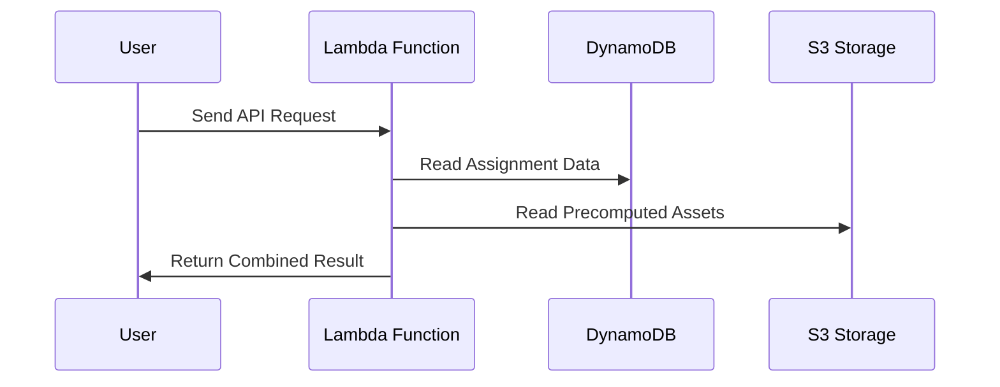

# V1 system design

## Problem statement

We have inconsistent and repeated logic across online experiments where we can't consistently assign participants to the assets that they should see in an experiment.

This is largely solved in platforms like Qualtrics, but it ties us to using these platforms. This is undesirable as we create a lot of websites to do our experiments.

We have three problems:

- We often create the assets that users will see (e.g., which posts they'll be shown) on-demand. This means we don't know what users will be shown until we create it on-demand. We would rather precompute these, check them for correctness/balance/quality first, and then as users log on, we assign them to one of the precomputed bundles. This can be slightly lossy if we care about edge cases (e.g., a participant is assigned but they drop out during the study), but given the low cost of creating these bundles, we overprovision them.
- We determine a participant's condition on-demand. Doing this means that we do balancing and assignment on-demand. This is not an atomic operation. Our existing solution has been that once a user logs in, we load a .json file of the users assigned to each condition. However, this leads to prominent TOCTOU race conditions: two users can log in at the same time, see an identical .json file, and both try to update it but upon updating, both their records override each other, so we only record the updated state of whoever was updated second. Given that our studies are decently long (>=5-10 minutes), the window for this TOCTOU race makes this a real concern. We want a solution that implements a something like an atomic "compare-and-swap" operation (specifically for our case, something like an atomic "read-then-update") so that users cannot be assigned to a bundle that someone else has already been assigned to.
- The above 2 problems are reimplemented over and over across experiments using hacky solutions that coalesce these into a single handler and also don't really solve the TOCTOU problem.

To solve this problem, we create a single unified design to manage the (1) precomputation of study assets and (2) atomic assignment of study users to a study condition (and thus picking which study assets will be given to them).

## Initial design

The initial design will have this high-level setup:

- S3 for blob storage.
- DynamoDB for atomic assignment.
- Lambdas for intermediate operations (e.g., running precomputation, accessing assignments from DynamoDB).

### Proposed tables

`user_assignments`

- study_id: str
- study_iteration_id: str
- user_id: str (can use the user's prolific ID here)
- payload: str (JSON string that can be configured to have whatever we want).
- created_at: str

PK: (study_id, study_iteration_id,)

`study_assignment_counter`

- study_id: str
- study_iteration_id: str
- study_unique_assignment_key: str (can, for example, use (political_party, condition) for the MirrorView project).
- counter: int (this is the unit that we're updating).
- created_at: str
- last_updated_at: str

PK: (study_id, study_iteration_id, study_unique_assignment_key)

Can see if we should make the timestamp fields a native timestamp time or just a string. This just updates where we move stuff later on. We'll also use `study_iteration_id` to denote if we're doing dev/test testing (one approach is just prepending `dev_` or `test_` to the `study_iteration_id`).

### Proposed API interface



1. **User Initiates Request:** The user sends an API request (for example, to participate in a study) to the backend via the Lambda function.

2. **Lambda Function Processes:** The Lambda function acts as an intermediary, orchestrating the logic required to handle the request.

3. **DynamoDB Assignment Lookup:** The Lambda first queries DynamoDB to retrieve the participant's assignment or determine which condition/bundle should be allocated. This may involve atomic assignment to prevent concurrent access issues.

4. **S3 Asset Fetching:** Once the assignment data is obtained, the Lambda function fetches the appropriate precomputed assets (e.g., stimulus bundles) from S3 storage, corresponding to the participant's assignment.

5. **Return Combined Response:** The Lambda function packages the assignment information and the fetched assets, then returns this combined result to the user.

This flow ensures that user assignment is managed atomically and assets are delivered reliably using AWS managed services.

### Proposed V1 implementation

We have a specific use case that we want this to work for, our MirrorView project. See [this GitHub repo](https://github.com/METResearchGroup/mirrorView-task) for more information..

#### Milestone 1: Create MirrorView-specific initial implementations

By doing this first, we make sure that we create just enough specs to meet the use case that we're directly solving. We need this delivered by EoD on Monday, so we want to make sure that we address this first.

##### PR 1: Initial batch jobs

Create local precomputation of the records for the pilot. Verification = batch job + local pytest testing. We want to shuffle based on political party + condition, so perhaps we can have a setup like:

```bash
<unique identifier for job, maybe a timestamp>/
    democrat/
        control/
            assignments.json
            metadata.json # contains any metadata about the assignments. Still unsure what we should put here.
        training_assisted/
    republican/
    metadata.json # a file with metadata about the precomputed generation.
```

I'm thinking that for assignments.json, we can have something like this for a schema:

```python
class Assignment:
    id: str # something like {political_party}-{condition}_{number} (e.g., democrat-control-001)
    assigned_post_ids: list[str]
    condition: str
    created_at: str
```

Currently, the existing app lambda returns the following response to the frontend when fetching posts:

```javascript
return corsResponse(200, {
    assigned_post_ids: prolificUserIssuedAssignmentPosts.map(p => p.post_id || p),
    already_assigned: true,
    condition: prolificUserIssuedAssignment.condition,
    isTest: isTest
});
```

So, we really just need `assigned_post_ids` and `condition`. By default, `already_assigned` will be true, and we'll use the `study_iteration_id` to determine if we're doing a dev/test run.

NOTE: need to double-check and verify that we only have 2 political party groups. I think this is the case, though I should check. Even if not, our implementation is still robust anyways.

NOTE: need to verify the condition names.

Let's store the random assignments in a single .json file. This helps us avoid the "many small files" problem that we get in S3, where we are charged on the number of file reads (and also number of encryptions/decryptions).

Right now, Billy is thinking of whether we should have 2 or 3 conditions. Since the spec currently only has 2 conditions, let's go with that for now.

We probably want something like minimum 500 per cell, since we have a 2 (republican/democrat) x 2 (control/training-assisted). To be safe, let's do 1,000 per cell (assignment is inexpensive and extra storage is at the level of KBs).

Each row should be idempotent on the ID. We care about idempotency only at the level of the given JSON. The batch folders serve as their own primary identifier.

A proposed file structure is something like:

```bash
data/
    mirrorview/
        # (store data in the structure above)
jobs/
    mirrorview/
        precompute_assignments.py
        tests/
            test_precompute_assigments.py
```

##### PR 2: Create logic to upload batch job to S3

Can be specific to MirrorView for now, to avoid overengineering a solution. Deliverable is a Python script that uploads the precomputed data to the desired S3 path. For now, we can use `mirrorview-pilot/` as the bucket and we can use `precomputed_assignments/<timestamp>/` as the key. Let's upload the precomputed assignments to roughly match the key structure in `PR 1: Initial batch jobs`. A proposed file setup is:

```bash
lib/
    s3.py # perhaps implement a `class S3` here to manage all read/write ops.

jobs/
    mirrorview/
        upload_precomputed_data_to_s3.py
```

Verification involves looking at the S3 bucket and verifying that the uploaded files exist in S3 in the correct keys.

#### Milestone 2: Ensure generalization

Once we have a MirrorView-specific implementation, let's make sure it's generalizable for other jobs we may have in the future.

##### PR 3: Set up DynamoDB tables

We set up the two DynamoDB tables.

`user_assignments`

- study_id: str
- study_iteration_id: str
- user_id: str (can use the user's prolific ID here)
- payload: str (JSON string that can be configured to have whatever we want).
- created_at: str

PK: (study_id, study_iteration_id, user_id)

`study_assignment_counter`

- study_id: str
- study_iteration_id: str
- study_unique_assignment_key: str (can, for example, use (political_party, condition) for the MirrorView project).
- counter: int (this is the unit that we're updating).
- created_at: str
- last_updated_at: str

PK: (study_id, study_iteration_id, study_unique_assignment_key)

We set up Terraform for this and deploy Terraform. We then run one-off tests to verify functionality.

Tests:

- Basic end-to-end request flow (write/read).
- Request for case when a row doesn't exist yet (e.g., a new user or a new `study_unique_assignment_key`).
  - For `user_assignments`, if a user doesn't exist yet and we do a READ request, should return None. For writes, if a user doesn't exist, write the user and then return the record.
  - For `study_assignment_counter`, if a `(study_id, study_iteration_id, study_unique_assignment_key)` doesn't exist on read, add it and increment counter by 1. This lets us verify our idempotency properties.
- Concurrent requests to iterate counter for the same row (to verify idempotency): expected to iterate the counter twice and return two distinct sequential results.

For `user_assignments`, let's have the payload be the following:

```bash
{
    s3_bucket: str # s3 bucket
    s3_key: str # the S3 key to their precomputed assignment
    assignment_id: str # the ID of which assignment is theirs
    metadata: str # JSON-dumped of their (politica_party, condition)
}
```

So, we'd have something like:

```python
json.dumps(
    {
        s3_bucket: "<bucket>",
        s3_key: "<key>",
        assignment_id: "democrat-control-001",
        metadata: {"political_party": "democrat", "condition": "control"}
    }
)
```

Proposed file structure:

```bash
lib/
    dynamodb.py # contains write/read helpers. Perhaps implement a `class DynamoDB` here.
infra/
    main.tf
    tests/
        dynamodb_e2e_tests.py
```

Success involves running the `dynamodb_e2e_tests.py` locally and also verifying in the AWS console that our test cases worked.

##### PR 4: Set up lambda to interact with DynamoDB + S3

Set up the lambda to interact with DynamoDB + S3. Let's use a Docker build for this.

Flow:

1. Request comes to the lambda, with the following fields in the payload:

- study_id
- study_iteration_id
- prolific_id
- political_party

2. Lambda checks `user_assignments` and sees if the user has a record already.

- If yes: JSON-load their "payload" and construct the S3 path from their S3 bucket + key for the precomputed assignment.
- If no: lambda needs to assign the user. They ping the `study_assignment_counter` and fetch `study_unique_assignment_key` for a substring match on their political party (e.g., `(democrat),`). We're OK with doing a substring match rather than doing an index because we don't expect many rows (maybe max 3 for a given political party). We read and increment whichever row has the lowest value in the counter (and we don't care which is picked in the case of a tie).
- We then write this record to the `user_assignments`. Of course, if this write fails, we've now incremented `study_assignment_counter` for a user that wasn't assigned. This is OK as we're OK with this slight lossiness; at our scale (research study) this doesn't matter. The bigger concern is making sure that updates to `study_assignment_counter` are exactly atomic, which we've guaranteed here.
- Once we've written a record to `user_assignments`, we know the political party + condition. This lets us compute the S3 bucket + key for the precomputed assignment that we need.

By default, let's use the latest batch job results that uploaded precomputed assignments to S3. We can add a step to do a "list keys" on the s3 path to figure out which key prefix corresponds to the latest subset of precomputed records.

End result: we know the S3 bucket + key for the precomputed assignment that we need to fetch.

Proposed file structure:

```bash
infra/
    main.tf # add here
    tests/
        api_lambda_e2e_tests.py
Dockerfiles/
    lambda_api.Dockerfile
```

Success involves running the `api_lambda_e2e_tests.py` locally and also verifying in the AWS console that our test cases worked.

Retry policy: let's use `tenacity` to manage exponential backoff retries on all GET requests. We're OK with using a lambda for this as this request is NOT resource-intensive by any means (<1MB) and requests are short-lived (probably <10 seconds, excluding cold start of the lambda).

- Note: need to make sure that callers have appropriate waiting behavior to account for the lambda's cold-start problem. Given that the current approach that we're changing fetches data using a lambda (and does a lot of computation during the request), our strictly faster and more memory-efficient approach should have no problems.

### Concurrency patterns

#### Addressing TOCTOU race conditions using atomic updates

Importantly, DynamoDB supports atomic updates using `UpdateItem`:

```python
import boto3
from botocore.exceptions import ClientError

dynamodb = boto3.client("dynamodb")

COUNTER_TABLE = "bundle_counters"

def request_new_bundle(party: str) -> str:
    try:
        response = dynamodb.update_item(
            TableName=COUNTER_TABLE,
            Key={"party": {"S": party}},
            UpdateExpression="SET next_index = if_not_exists(next_index, :zero) + :one",
            ExpressionAttributeValues={
                ":zero": {"N": "0"},
                ":one": {"N": "1"},
            },
            ReturnValues="UPDATED_NEW",
        )
    except ClientError as e:
        raise RuntimeError(f"Failed to allocate bundle for party={party}") from e

    next_index = int(response["Attributes"]["next_index"]["N"])
    return f"{party}-control-{next_index:04d}"
```

This avoids two concurrent callers both seeing the same prior value, because the increment itself is atomic and applied without interfering with other writes. See [these AWS docs](https://docs.aws.amazon.com/amazondynamodb/latest/developerguide/example_dynamodb_Scenario_AtomicCounterOperations_section.html) for more detail + examples.

We'll probably want to implement something like this example from the SDK docs, so we can increment and do so safely (i.e., even when the unique key for the counter doesn't exist):

```python
def increment_counter_safely(
    table_name: str,
    key: Dict[str, Any],
    counter_name: str,
    increment_value: int = 1,
    initial_value: int = 0,
) -> Dict[str, Any]:
    """
    Increment a counter attribute safely, handling the case where it might not exist.

    This function demonstrates a best practice for incrementing counters by using
    the if_not_exists function to handle the case where the counter doesn't exist yet.

    Args:
        table_name (str): The name of the DynamoDB table.
        key (Dict[str, Any]): The primary key of the item to update.
        counter_name (str): The name of the counter attribute.
        increment_value (int, optional): The value to increment by. Defaults to 1.
        initial_value (int, optional): The initial value if the counter doesn't exist. Defaults to 0.

    Returns:
        Dict[str, Any]: The response from DynamoDB containing the updated attribute values.
    """
    # Initialize the DynamoDB resource
    dynamodb = boto3.resource("dynamodb")
    table = dynamodb.Table(table_name)

    # Use SET with if_not_exists to safely increment the counter
    response = table.update_item(
        Key=key,
        UpdateExpression="SET #counter = if_not_exists(#counter, :initial) + :increment",
        ExpressionAttributeNames={"#counter": counter_name},
        ExpressionAttributeValues={":increment": increment_value, ":initial": initial_value},
        ReturnValues="UPDATED_NEW",
    )

    return response
```

### Non-functional requirements

- Storage: these experiments that we're supporting will have max ~1,000-2,000 users. Assuming that each bundle of assets to show users is something like 2-5MB at most (and again, that's very generous, as averages are probably <1MB), then we need at most 2-10GB to store the assets. This is likely overprovisioning, as we can just store the minimum amount of combinations rather than storing each possible permutation needed. We can also store the minimum identifiable information for each bundle and then just fetch the hydrated versios on-demand. For example, for our current use case (MirrorView), instead of storing the hydrated posts in the bundle, we just store the post IDs. Then, on demand, we load maybe 10-20KB of data. At this rate, for 1,000-2,000 users, we store max 40MB of precomputed bundles.

- Scalability: each component is highly scalable by default, and definitely for our use case of 1,000-2,000 users. Will keep this discussion here as we don't need "scalable" solutions (for example, we expect less than 1 QPS on average for any requests).

- Reliability: solutions are managed by AWS. We don't host any persistent servers ourselves and just spin up lambdas as needed.
