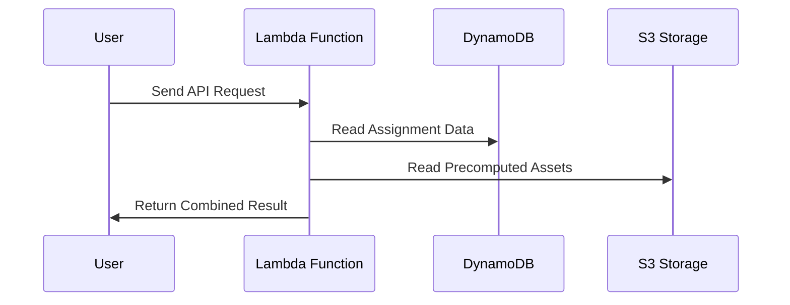

# V1 system design

## Problem statement

We have inconsistent and repeated logic across online experiments where we can't consistently assign participants to the assets that they should see in an experiment.

This is largely solved in platforms like Qualtrics, but it ties us to using these platforms. This is undesirable as we create a lot of websites to do our experiments.

We have three problems:

- We often create the assets that users will see (e.g., which posts they'll be shown) on-demand. This means we don't know what users will be shown until we create it on-demand. We would rather precompute these, check them for correctness/balance/quality first, and then as users log on, we assign them to one of the precomputed bundles. This can be slightly lossy if we care about edge cases (e.g., a participant is assigned but they drop out during the study), but given the low cost of creating these bundles, we overprovision them.
- We determine a participant's condition on-demand. Doing this means that we do balancing and assignment on-demand. This is not an atomic operation. Our existing solution has been that once a user logs in, we load a .json file of the users assigned to each condition. However, this leads to prominent TOCTOU race conditions: two users can log in at the same time, see an identical .json file, and both try to update it but upon updating, both their records override each other, so we only record the updated state of whoever was updated second. Given that our studies are decently long (>=5-10 minutes), the window for this TOCTOU race makes this a real concern. We want a solution that implements a something liike an atomic "compare-and-swap" operation (specifically for our caase, something like an atomic "read-then-update") so that users cannot be assigned to a bundle that someone else has already been assigned to.
- The above 2 problems are reimplemented over and over across experiments using hacky solutions that coalesce these into a single handler and also don't really solve the TOCTOU problem.

To solve this problem, we create a single unified design to manage the (1) precomputation of study assets and (2) atomic assignment of study users to a study condition (and thus picking which study assets will be given to them).

## Initial design

The initial design will have this high-level setup:

- S3 for blob storage.
- DynamoDB for atomic assignment.
- Lambdas for intermediate operations (e.g., running precomputation, accessing assignments from DynamoDB).

### Proposed tables

`user_assignments`

- study_id: str
- study_iteration_id: str
- user_id: str (can use the user's prolific ID here)
- payload: str (JSON string that can be configured to have whatever we want).
- created_at: str

PK: (study_id, study_iteration_id,)

`study_assignment_counter`

- study_id: str
- study_iteration_id: str
- study_unique_assignment_key: str (can, for example, use (politica_party, condition) for the MirrorView project).
- counter: int (this is the unit that we're updating).
- created_at: str
- last_updated_at: str

Can see if we should make the timestamp fields a native timestamp time or just a string. This just updates where we move stuff later on.

### Proposed API interface



1. **User Initiates Request:** The user sends an API request (for example, to participate in a study) to the backend via the Lambda function.

2. **Lambda Function Processes:** The Lambda function acts as an intermediary, orchestrating the logic required to handle the request.

3. **DynamoDB Assignment Lookup:** The Lambda first queries DynamoDB to retrieve the participant's assignment or determine which condition/bundle should be allocated. This may involve atomic assignment to prevent concurrent access issues.

4. **S3 Asset Fetching:** Once the assignment data is obtained, the Lambda function fetches the appropriate precomputed assets (e.g., stimulus bundles) from S3 storage, corresponding to the participant's assignment.

5. **Return Combined Response:** The Lambda function packages the assignment information and the fetched assets, then returns this combined result to the user.

This flow ensures that user assignment is managed atomically and assets are delivered reliably using AWS managed services.

### Concurrency patterns

#### Addressing TOCTOU race conditions using atomic updates

Importantly, DynamoDB supports atomic updates using `UpdateItem`:

```python
import boto3
from botocore.exceptions import ClientError

dynamodb = boto3.client("dynamodb")

COUNTER_TABLE = "bundle_counters"

def request_new_bundle(party: str) -> str:
    try:
        response = dynamodb.update_item(
            TableName=COUNTER_TABLE,
            Key={"party": {"S": party}},
            UpdateExpression="SET next_index = if_not_exists(next_index, :zero) + :one",
            ExpressionAttributeValues={
                ":zero": {"N": "0"},
                ":one": {"N": "1"},
            },
            ReturnValues="UPDATED_NEW",
        )
    except ClientError as e:
        raise RuntimeError(f"Failed to allocate bundle for party={party}") from e

    next_index = int(response["Attributes"]["next_index"]["N"])
    return f"{party}-control-{next_index:04d}"
```

This avoids two concurrent callers both seeing the same prior value, because the increment itself is atomic and applied without interfering with other writes. See [these AWS docs](ahttps://docs.aws.amazon.com/amazondynamodb/latest/developerguide/example_dynamodb_Scenario_AtomicCounterOperations_section.html) for more detail + examples.

We'll probably want to implement something like this example from the SDK docs, so we can increment and do so safely (i.e., even when the unique key for the counter doesn't exist):

```python
def increment_counter_safely(
    table_name: str,
    key: Dict[str, Any],
    counter_name: str,
    increment_value: int = 1,
    initial_value: int = 0,
) -> Dict[str, Any]:
    """
    Increment a counter attribute safely, handling the case where it might not exist.

    This function demonstrates a best practice for incrementing counters by using
    the if_not_exists function to handle the case where the counter doesn't exist yet.

    Args:
        table_name (str): The name of the DynamoDB table.
        key (Dict[str, Any]): The primary key of the item to update.
        counter_name (str): The name of the counter attribute.
        increment_value (int, optional): The value to increment by. Defaults to 1.
        initial_value (int, optional): The initial value if the counter doesn't exist. Defaults to 0.

    Returns:
        Dict[str, Any]: The response from DynamoDB containing the updated attribute values.
    """
    # Initialize the DynamoDB resource
    dynamodb = boto3.resource("dynamodb")
    table = dynamodb.Table(table_name)

    # Use SET with if_not_exists to safely increment the counter
    response = table.update_item(
        Key=key,
        UpdateExpression="SET #counter = if_not_exists(#counter, :initial) + :increment",
        ExpressionAttributeNames={"#counter": counter_name},
        ExpressionAttributeValues={":increment": increment_value, ":initial": initial_value},
        ReturnValues="UPDATED_NEW",
    )

    return response
```

### Non-functional requirements

- Storage: these experiments that we're supporting will have max ~1,000-2,000 users. Assuming that each bundle of assets to show users is something like 2-5MB at most (and again, that's very generous, as averages are probably <1MB), then we need at most 2-10GB to store the assets. This is likely overprovisioning, as we can just store the minimum amount of combinations rather than storing each possible permutation needed. We can also store the minimum identifiable information for each bundle and then just fetch the hydrated versios on-demand. For example, for our current use case (MirrorView), instead of storing the hydrated posts in the bundle, we just store the post IDs. Then, on demand, we load maybe 10-20KB of data. At this rate, for 1,000-2,000 users, we store max 40MB of precomputed bundles.

- Scalability: each component is highly scalable by default, and definitely for our use case of 1,000-2,000 users. Will keep this discussion here as we don't need "scalable" solutions (for example, we expect less than 1 QPS on average for any requests).

- Reliability: solutions are managed by AWS. We don't host any persistent servers ourselves and just spin up lambdas as needed.
